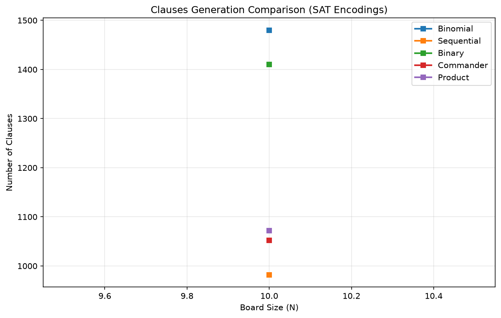
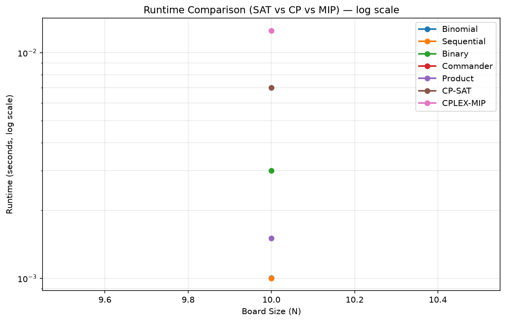

# N-Queens Problem: Exact SAT Solving vs Constraint Programming

[](https://www.python.org/)
[](https://pysathq.github.io/)
[](https://developers.google.com/optimization/cp/cp_solver)

Dự án này là đồ án môn học nhằm giải quyết bài toán N-Queens kinh điển bằng các phương pháp tối ưu hóa chính xác (Exact Optimization). Trọng tâm của đồ án là việc mô hình hóa bài toán sang Dạng chuẩn hội (CNF) để giải bằng **SAT Solver**, đồng thời đối chuẩn hiệu năng với mô hình **Constraint Programming (CP)**.

## 🌟 Tính năng nổi bật

Dự án triển khai và phân tích toán học 5 chuẩn mã hóa At-Most-One (AMO) khác nhau để chuyển đổi ràng buộc N-Queens sang logic mệnh đề:
1. **Binomial (Pairwise)**: Không dùng biến phụ, $O(n^2)$ mệnh đề.
2. **Sequential Counter**: Sinh $O(n)$ biến phụ, $O(n)$ mệnh đề.
3. **Binary**: Sinh $O(\log n)$ biến phụ.
4. **Commander**: Thuật toán chia nhóm, $O(\sqrt{n})$ biến phụ.
5. **Product**: Thuật toán ma trận 2D, $O(\sqrt{n})$ biến phụ.

Ngoài ra, dự án tích hợp bộ giải **CP-SAT** từ thư viện Google OR-Tools (sử dụng ràng buộc toàn cục `AddAllDifferent`) để chứng minh giới hạn (bottleneck) của các thuật toán SAT truyền thống.

## 📊 Kết quả Thực nghiệm

Dự án cung cấp công cụ benchmark tự động chạy từ $N=10$ đến $N=30$. Mỗi cấu hình được chạy lặp lại **3 lần** và lấy giá trị trung bình nhằm loại bỏ nhiễu đo lường. Thời gian được tách thành hai thành phần riêng biệt: **thời gian sinh mệnh đề** (`Gen_Time`) và **thời gian giải** (`Solve_Time`). Nghiệm đầu ra của mọi encoding SAT đều được **hậu kiểm độc lập** (`Solution_Valid`) để đảm bảo đúng $N$ quân và không tấn công nhau.

### 1. Sự bùng nổ mệnh đề (Clause Explosion)
Chuẩn Binomial phình to bộ nhớ cực nhanh theo hàm bậc hai, trong khi Sequential và Product giữ được số lượng mệnh đề rất nhỏ gọn nhờ các biến phụ.



### 2. Nghịch lý Thời gian giải (Runtime Bottleneck)
Mặc dù Product và Binary có rất ít mệnh đề, việc chèn thêm các "biến phụ" (auxiliary variables) làm nhiễu loạn nghiêm trọng hệ thống Heuristic của bộ giải SAT, khiến thời gian giải bùng nổ lên tới gần 27 giây ở $N=30$ (Product) và 5.28 giây (Binary).

Đáng chú ý, kết quả cho thấy mức suy thoái **không tỉ lệ thuận với số lượng biến phụ**. **Commander** chỉ mất **0.034s** tại $N=30$ — nhanh nhất trong tất cả các encoding SAT, bất chấp việc sinh tới 1.606 biến phụ. Nguyên nhân là cấu trúc nhóm cục bộ của Commander giúp lan truyền đơn vị loại bỏ nhanh cả một nhóm, trong khi ma trận 2D của Product tạo chuỗi kéo theo dài và phân tán. **Binomial** (không biến phụ) đứng thứ hai với 0.028s. Cuối cùng, CP-SAT thống trị hoàn toàn bài toán với thời gian chỉ khoảng 0.06 giây ở $N=30$.

Xem bảng chi tiết tại mốc $N=30$ (đơn vị giây):

| Encoding / Solver | Mệnh đề | Biến | Gen (s) | Solve (s) | Tổng (s) |
|---|---|---|---|---|---|
| Binomial | 43.240 | 900 | 0.02120 | 0.00684 | 0.02804 |
| Sequential | 10.122 | 4.322 | 0.00133 | 0.69580 | 0.69713 |
| Binary | 17.286 | 1.666 | 0.01001 | 2.47122 | 2.48124 |
| Commander | 13.358 | 1.606 | 0.00301 | 0.03406 | 0.03708 |
| Product | 10.200 | 2.426 | 0.00215 | 26.83777 | 26.83992 |
| CP-SAT | — | — | 0.00167 | 0.08832 | 0.08999 |
| CPLEX-MIP | — | — | 0.02179 | 0.02119 | 0.04298 |

Lưu ý: cột **Gen** là thời gian sinh mệnh đề bằng Python, còn **Solve** mới là thời gian bộ giải SAT thực sự tìm nghiệm. Với Binomial, phần lớn thời gian nằm ở bước sinh mệnh đề chứ không phải ở bộ giải.



## 📁 Cấu trúc Dự án

```text
NQueens_SAT_Project/
├── src/
│   ├── encoder.py          # Chứa 5 thuật toán mã hóa AMO sang CNF
│   ├── solver.py           # Tích hợp PySAT (Glucose3 cho SAT)
│   ├── cp_solver.py        # Tích hợp Google OR-Tools (CP-SAT)
│   ├── cplex_mip_solver.py # Tích hợp IBM CPLEX (MIP/ILP)
│   ├── cplex_cp_solver.py  # Tích hợp IBM CPLEX CP Optimizer
│   ├── visualize.py        # In bàn cờ N-Queens trực quan ra terminal
│   └── benchmark.py        # Kịch bản chạy đo lường và vẽ biểu đồ tự động
├── results/            # Chứa file CSV và các biểu đồ PNG
│   ├── sat_vs_cp_benchmark.csv      # Dữ liệu thực nghiệm đầy đủ
│   ├── chart_runtime_comparison.png # Biểu đồ thời gian (thang log)
│   └── chart_clauses_comparison.png # Biểu đồ số lượng mệnh đề
├── report/
│   └── main.tex        # Báo cáo học thuật LaTeX chuẩn Elsevier
├── requirements.txt
└── README.md
```

## 🚀 Hướng dẫn Cài đặt & Sử dụng

**Bước 1: Cài đặt môi trường**
```bash
python -m venv venv
.\venv\Scripts\activate
pip install -r requirements.txt
```

**Bước 2: Chạy Benchmark và sinh biểu đồ**
```bash
python src/benchmark.py
```

Kịch bản hỗ trợ các tham số dòng lệnh để chạy chọn lọc (hữu ích khi chỉ muốn chạy lại một mốc $N$ lớn):

| Tham số | Mặc định | Mô tả |
|---|---|---|
| `--sizes` | `10 15 20 25 30` | Các mốc $N$ cần chạy |
| `--methods` | cả 8 phương pháp | Các phương pháp cần chạy |
| `--repeats` | `3` | Số lần lặp mỗi cấu hình để lấy trung bình |
| `--timeout` | `100` | Giới hạn thời gian giải mỗi lần (giây) |
| `--solver` | `glucose3` | Bộ giải PySAT sử dụng |
| `--out` | `sat_vs_cp_benchmark.csv` | Tên file CSV đầu ra |
| `--no-append` | tắt | Ghi đè CSV thay vì ghép thêm dữ liệu cũ |

Ví dụ, chỉ chạy lại mốc $N=30$ với 5 lần lặp:
```bash
python src/benchmark.py --sizes 30 --repeats 5
```

Dữ liệu sẽ được lưu tự động vào thư mục `results/`.
